 

## ✨ About

## 🛠️ Arsenal

 

## 📊 Stats

  

## 📌 Pinned

 

 

 

## 🐍 Contribution Snake

<picture>
  <source media="(prefers-color-scheme: dark)" srcset="https://raw.githubusercontent.com/JasperLKH/JasperLKH/output/github-snake-dark.svg"/>
  <source media="(prefers-color-scheme: light)" srcset="https://raw.githubusercontent.com/JasperLKH/JasperLKH/output/github-snake.svg"/>
  
</picture>

## 🌐 Reach Me

 

  

